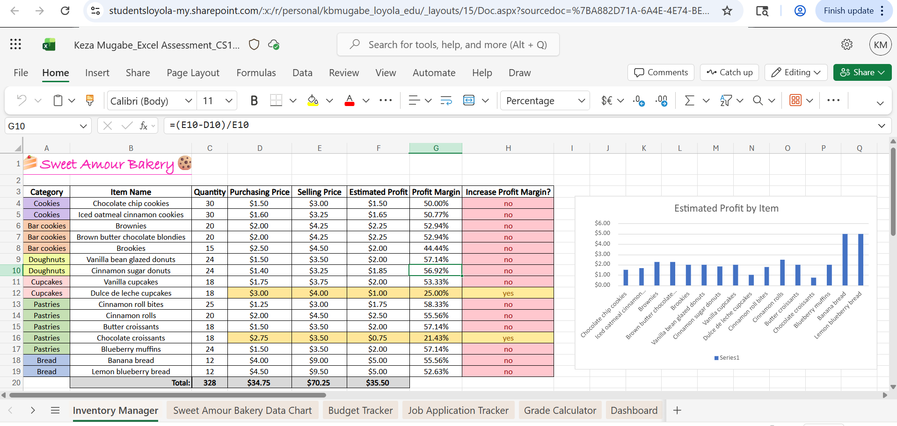
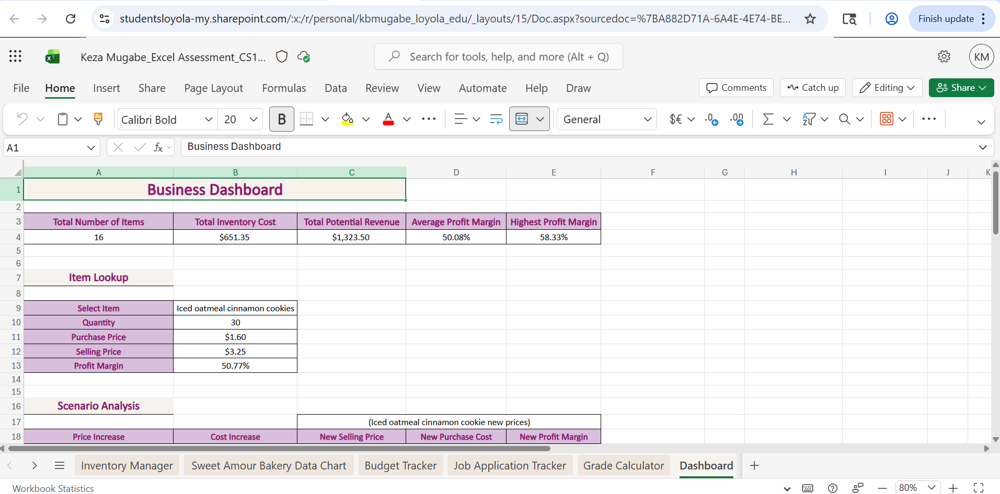
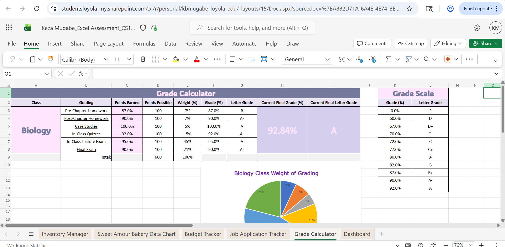

# CS105/6/7/8 Portfolio
## Keza Mgabe
## Portfolio
Contact Info: [fill in]
Hello! I am an experienced Biohealth specialist and Health Sciences professional with over 6 years of proven expertise in Biohealth and Public Health and Patient Care.  

 With skills in communication, data analysis, patient support, and critical thinking, I am able to analyze health data and achieve improved health outcomes. I am adept at using Microsoft excel, Google workspace, and PyCharm. 

My well-rounded skill set, commitment to excellence in healthcare, and passion for improving community health make me a valuable asset. In my spare time, I like to bake and spend time with my family and friends.  
You can find me on Twitter at Mugabe_K. 

## Education 
[Fill in Education here]
***
## Projects

### Inventory Manager
 - Project 1 Summary

- Without a structured system, it can be difficult to keep track of how much profit is being made and which items are performing well. So, I created an inventory manager for my small side business bakery. This is a problem that needed to be solved because it could lead to financial loss, under or overpricing items, and overstocking. In completing this project, I used Microsoft Excel. I didn’t really encounter any challenges with the inventory manager. Yes, my cousins helped me come up with the item names and prices. I set out to create an organized functional inventory system that could track my bakery items, calculate profit, and help analyze my business performance. I believe I achieved this goal because I can clearly see item costs, selling prices, and profits in one table. If I had the chance to take this further, I would add more charts and make it more detailed. 
***
### Business Dashboard
 - Project 2 Summary

- I set out to create a system that makes it easier to understand and analyze my business data from inventory in one place. This was necessary because without a dashboard, it takes longer to interpret information like profit, costs, and performance. In completing this project, I used Microsoft Excel including formulas and lookup functions. If I improved it further, I would make it more detailed and add more advanced functions.  
***
#### Grade Calculator
 - Project 3 Summary

 - In university, grades are often weighed differently, so I created a grade calculator to solve the problem of not knowing the grade requirements of each course. It needed to be solved so that I can stay on top of my academics. In completing this project, I used Microsoft Excel. I had trouble figuring out what formula to use for automatically calculating the letter and number grades. Yes, I searched on YouTube and google. I set out to create a functional grade calculator that could accurately track my performance in two classes and help me predict my final grades. I achieved this goal because my calculator allows me to input grades and instantly see how they affect my overall average. If I had the chance to take this further, I would do it for all of my classes.
